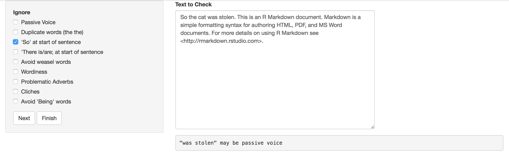

# gramr


**The goal of gramr is to help R programmers who can't write good and and wanna learn to do other stuff good too by checking a RMarkdown document for grammatical errors.**

This package wraps the command line tool, [`write-good`](https://github.com/btford/write-good) to provide grammar checking functions for Rmd or md documents. It can be used as an [RStudio Addin](https://rstudio.github.io/rstudioaddins/), or from the console or command line by supplying an Rmd or md filename.


## Installation

You can install `gramr` from github with:

```R
# install.packages("devtools")
devtools::install_github("ropenscilabs/gramr")
```

## Examples

`write_good_ip()`: run the write-good linter on text in a currently active Rmd file in RStudio

`write_good_file("my_file.Rmd")`: run the write-good linter on text in an Rmd file (RStudio not required)

`run_grammar_checker("example.rmd")`: run the write-good linter interactively



**Example Output**:
 
```r
> write_good_file("tests/testthat/test.Rmd")

#  index offset                              reason
#1    15     12 "been defined" may be passive voice
#2    49      8       "suddenly" can weaken meaning
```

## Contributing

Please note that this project is released with a [Contributor Code of Conduct](CONDUCT.md). By participating in this project you agree to abide by its terms.

## Acknowledgements

Thanks to [Brian Ford](https://github.com/btford) for the development of [write-good](https://github.com/btford/write-good)!
